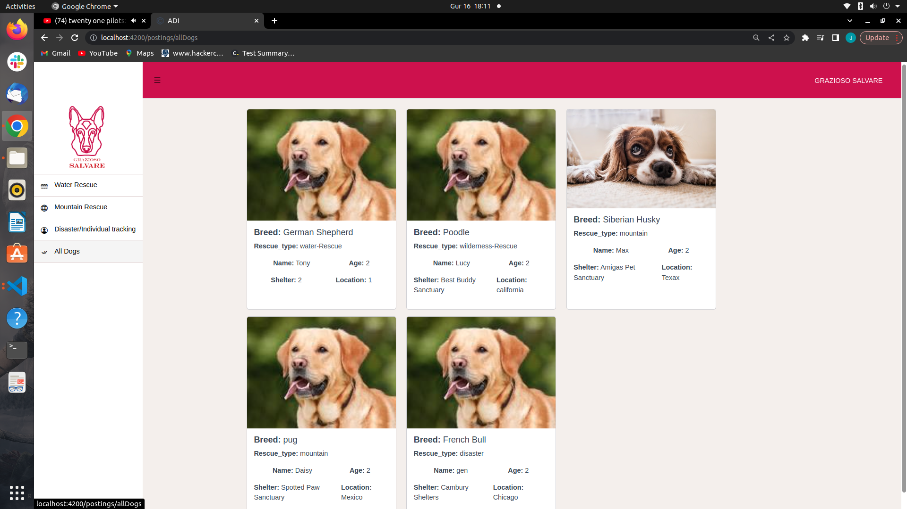

# How to run the app 

## 1:  Install Node.js:
    First, you need to install Node.js, which comes with the npm package manager. You can download and install the latest version of Node.js from the official website.

## 2:  Install Angular CLI:

    After installing Node.js, you need to install the Angular CLI (Command Line Interface) globally using the following command:
## 3: npm install

## 4: ng serve

### remember to use the current backend server url on app.constants.ts on client app

### screenshot of the app

    